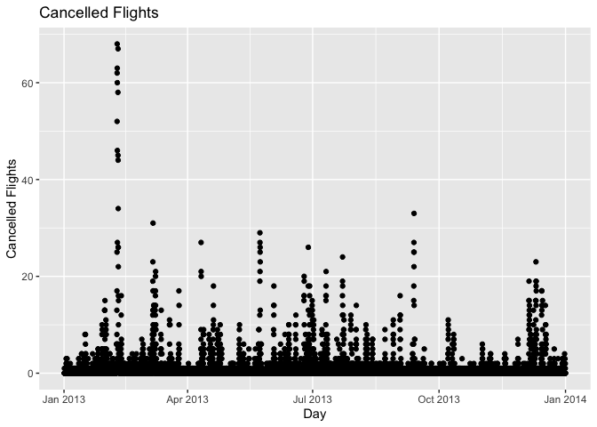

Flights\_Hmwk
================

``` r
#Question 1
#How many flights have a missing dep_time? 
sum(is.na(flights$dep_time))
```

    ## [1] 8255

``` r
#8255 flights have a missing departure time

#What other variables are missing? 
colSums(is.na(flights)) 
```

    ##           year          month            day       dep_time sched_dep_time 
    ##              0              0              0           8255              0 
    ##      dep_delay       arr_time sched_arr_time      arr_delay        carrier 
    ##           8255           8713              0           9430              0 
    ##         flight        tailnum         origin           dest       air_time 
    ##              0           2512              0              0           9430 
    ##       distance           hour         minute      time_hour 
    ##              0              0              0              0

``` r
#dep_time =8255, dep_delay = 8255, arr_time = 8713, arr_delay = 9430, 
#tailnum = 2512, and air_time = 9430 are the missing entries.

#What might these rows represent?
#these rows could represent flights that were canceled or didnt happen. 
```

``` r
#2) Currently dep_time and sched_dep_time are convenient to look at, but hard 
#to compute with because theyre not really continuous numbers. Convert them to 
#a more convenient representation of number of minutes since midnight.

updateDep = ((flights$dep_time %/% 100)*60 + (flights$dep_time %% 100)) 
updateSch = ((flights$sched_dep_time %/% 100)*60 + 
               (flights$sched_dep_time %% 100)) 
head(updateDep)
```

    ## [1] 317 333 342 344 354 354

``` r
head(updateSch)
```

    ## [1] 315 329 340 345 360 358

``` r
#these now represent times for flights data variables in minutes since midnight
#displated are the first few entires of data so the change to minutes is seen.
```

``` r
#3) Look at the number of cancelled flights per day. Is there a pattern? 
#Is the proportion of cancelled flights related to the average delay? Use 
#multiple dyplr operations, all on one line, concluding with 
#`ggplot(aes(x= ,y=)) + geom_point()'

flights %>% mutate(day_of_year =(time_hour)) %>% group_by(day_of_year) %>%
  summarise(cancellations=sum(is.na(dep_delay)), 
            n=n()) %>% ggplot(mapping = aes(y=cancellations, 
            x = (day_of_year))) + geom_point() +ggtitle("Cancelled Flights") +
            ylab("Cancelled Flights") + xlab("Day")
```

<!-- -->

``` r
#it looks like there maybe could be a pattern with the spikes, definitely spikes
#spaced out, they could be proportional.

#https://github.com/anchayes/FlightsData here is my github just in case.
```
